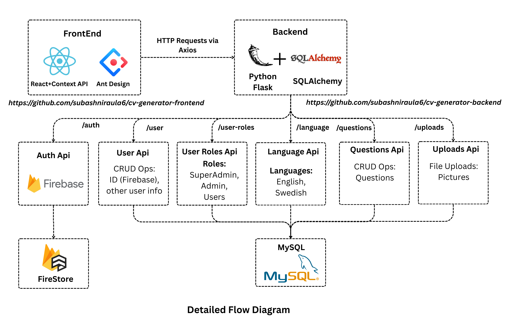

# 📄 CV Generator Backend

A user-friendly CV/Resume generator with a clean UI and a robust backend.


---

## 🚀 Live Demo

🎯 **Try it now:** [CV Generator Demo](https://kneg.thebasanta.xyz)
*Add screenshot of homepage or demo here*

---

## 📂 Repositories

* **Frontend:** [cv-generator-frontend](https://github.com/subashniraula6/cv-generator-frontend)
* **Backend:** This repository

---

## 🛠️ Project Setup

Follow these steps to set up the backend locally:

---

### 1️⃣ Setup Python Environment

Create a virtual environment and activate it:

```bash
python -m venv venv
source venv/bin/activate  # Linux/macOS
# OR
venv\Scripts\activate     # Windows
```

---

### 2️⃣ Install Dependencies

```bash
pip install -r requirements.txt
```

> ⚡ Tip: Upgrade pip to avoid conflicts:
>
> ```bash
> pip install --upgrade pip
> ```

---

### 3️⃣ Configure Environment Variables

Copy the development template and set your `.env`:

```bash
cp .env-dev .env
```

Open `.env` and update:

* Database credentials
* Firebase credentials
* Any API keys

---

### 4️⃣ Firebase Setup

1. Go to [Firebase Console](https://console.firebase.google.com/)
2. Create a project (if needed)
3. Generate a **Service Account Key** JSON file
4. Place it at:

```
private_keys/knegg_firebase_p_keys.json
```

> 🔑 Keep this file secure and **do not commit** it to Git.

---

### 5️⃣ Run Seeders (First Setup Only)

Seed default data: languages, user roles, and questions:

```bash
python seed.py
```

You should see output like:

```
Inserted language: English
Inserted role: superadmin
Inserted questions for language_id=1, category=General
Seeding complete!
```

> 💡 Only run this **during initial setup** or when you need to reload default data.
---

### 6️⃣ Start the Backend Server

```bash
python app.py
```

Server runs on:

```
http://127.0.0.1:8080
```

> ⚠️ Development server only. For production, use Gunicorn or another WSGI server.

*Add screenshot of server running/log output here*

---

## 📝 API Endpoints (Sample)

| Method | Endpoint          | Description          |
| ------ | ----------------- | -------------------- |
| GET    | `/`               | Backend health check |
| GET    | `/kneg/languages` | List all languages   |
| POST   | `/kneg/language`  | Add a new language   |
| POST   | `/kneg/question`  | Add a new question   |
| POST   | `/kneg/user-role` | Add a new user role  |

> 🔧 Use **Postman** or **cURL** to test the API.
---

## ⚡ Notes

* Always activate the virtual environment before running scripts.
* Run `seed.py` manually **only during first setup**.
* Keep `.env` and `private_keys` secure.
* Ensure MySQL or your database server is running before starting the backend.
